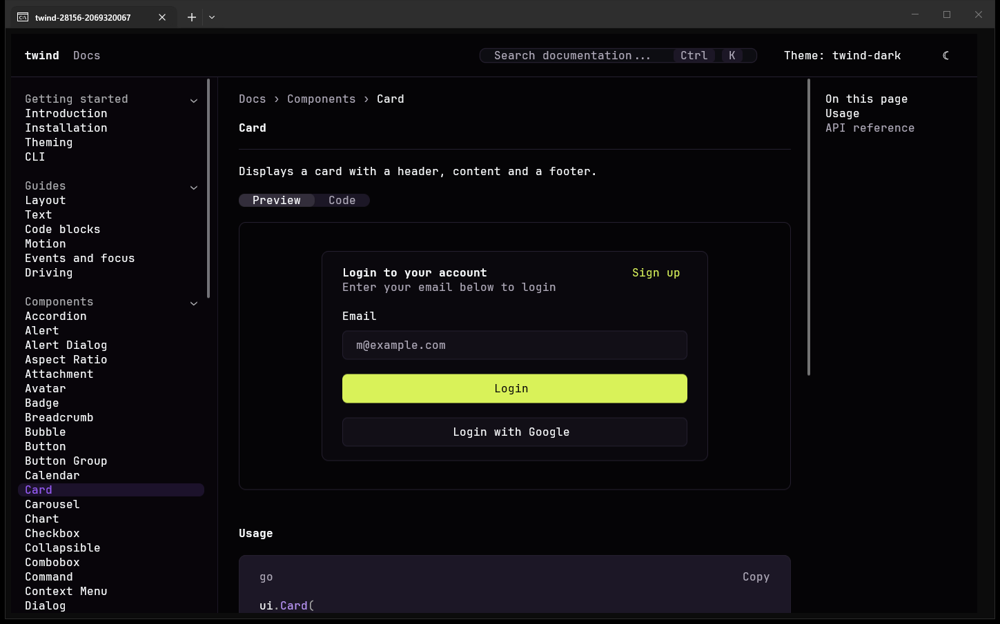
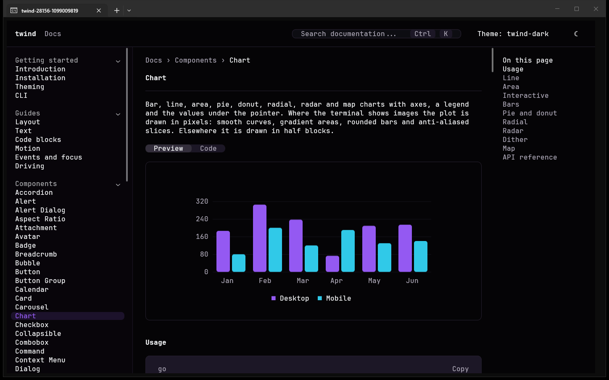

# Twind

Twind is a Go library for terminal apps that you build like a web page: a tree of elements styled with real Tailwind classes, laid out with flexbox and grid, with the shadcn/ui component set ready to use. Tailwind runs when you build, never when the app runs, so a program using Twind builds from a clean checkout with the Go toolchain alone.





## Try it

One command opens the documentation, itself a Twind app, in your terminal. It downloads the `twind` binary for your system from the latest GitHub release, checks its sha256 against the release's `checksums.txt`, keeps it in your user cache and runs it.

Windows, in PowerShell:

```powershell
irm twind.nkz.md/docs | iex
```

Linux and macOS:

```sh
curl -fsSL twind.nkz.md/docs | sh
```

Replace `docs` with `landing`, `portfolio`, `playground` or `gallery` to open one of the examples. To pass arguments, such as a page to open:

```powershell
& ([scriptblock]::Create((irm twind.nkz.md/docs))) -page button
```

```sh
curl -fsSL twind.nkz.md/docs | sh -s -- -page button
```

`TWIND_VERSION=v0.5.0` picks a release other than the latest. The cache is `%LocalAppData%\twind\try` on Windows, `~/.cache/twind/try` on Linux and `~/Library/Caches/twind/try` on macOS.

If you have Go, this does the same without a download script:

```sh
go run github.com/pehcastro/twind/cmd/twind@latest docs
```

## Use it

```sh
go get github.com/pehcastro/twind
```

```go
package main

import (
	"log"

	"github.com/pehcastro/twind/twi"
)

//go:generate go run github.com/pehcastro/twind/internal/twirgen

func main() {
	sheet, err := Styles()
	if err != nil {
		log.Fatal(err)
	}
	rt := twi.New(twi.Fullscreen(), twi.Styles(sheet))
	err = rt.Run(func() twi.Node {
		return twi.Element(twi.Class("m-2 rounded-lg border p-1"), twi.Text("Hello from Twind"))
	})
	if err != nil {
		log.Fatal(err)
	}
}
```

`go run github.com/pehcastro/twind/cmd/twind build` compiles the classes into `twir_gen.go`, which holds `Styles()`. It fetches the pinned Tailwind once and checks its checksum. Commit `twir_gen.go`; after that nobody needs Tailwind to build. Then `go run .`.

`go run github.com/pehcastro/twind/cmd/twind new myapp` writes a complete app to start from: a sidebar, cards, a dialog and a theme picker.

## More

- [Documentation](docs/introduction.md): every component and guide, the same pages `twind docs` shows.
- [SUPPORT_MATRIX.md](SUPPORT_MATRIX.md): what each terminal can show, tested by hand.
- [CHANGELOG.md](CHANGELOG.md): what changed in each version.

Twind is MIT licensed. See [LICENSE](LICENSE).
